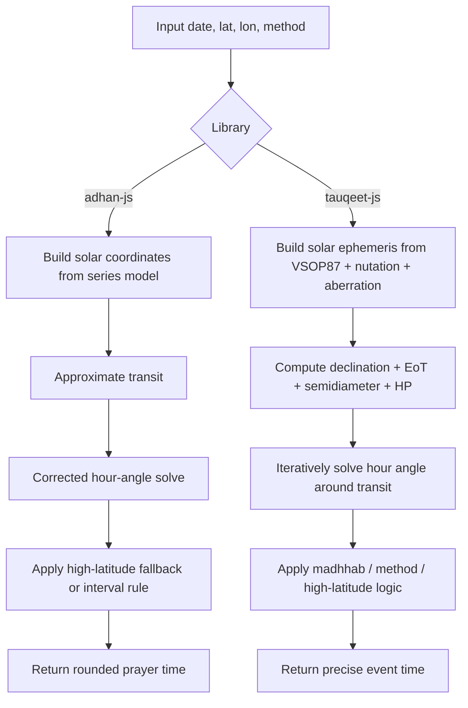

## Architectural Comparison: adhan-js vs tauqeet-js

The two libraries share the same astronomical target, but they do not share the same computational philosophy.

- adhan-js is a fast, compact, Meeus-style engine that favors a lightweight series-based solar model and a numerically stable correction procedure.
- tauqeet-js is a precision-oriented ephemeris engine that leans on a fuller solar-ephemeris pipeline, explicit EoT, and iterative refinement for each event.

A useful way to think about it is:

- adhan-js: “solve the event quickly with a robust approximation and a correction step”
- tauqeet-js: “solve the event precisely from a richer solar model and refine until the residual is negligible”

---

## 1) Normal Day Prayer-Time Core

### A. Solar declination and equation of time

| Aspect | adhan-js | tauqeet-js |
|---|---|---|
| Solar model | Series-based Meeus-style approximation from SolarCoordinates.ts | VSOP87-based heliocentric perturbation theory plus nutation/aberration in SolarPosition.ts |
| Declination | $\delta = \arcsin(\sin \epsilon_a \sin \lambda_a)$ | $\delta = \arcsin(\sin \beta_{corr}\cos\epsilon + \cos\beta_{corr}\sin\epsilon \sin \lambda_{app})$ |
| Equation of Time | Not exposed as a standalone scalar; it is folded into transit/hour-angle corrections | Explicitly computed as $EoT = 4(L_0 - \alpha)$ after normalization to $\pm 180^\circ$ |
| Sidereal time | Computed as apparent sidereal time from mean sidereal time + nutation correction | Computed in the full solar ephemeris path, but not needed by the prayer-specific subset path |

### Why this matters

adhan-js uses a compact, fast solar coordinate model:
- mean solar longitude
- equation of the center
- apparent longitude
- obliquity correction
- nutation terms

tauqeet-js computes from a more physically complete chain:
- heliocentric Earth state from VSOP87
- solar apparent longitude and latitude correction
- aberration and nutation
- then derives declination and EoT from that state

So the difference is not just “more terms” — it is a different level of physical modeling. tauqeet-js is aiming at higher fidelity in the underlying solar geometry.

---

### B. Hour-angle solution for Fajr, Sunrise, Maghrib, Isha

Both libraries solve the same spherical-trigonometry equation:

$$
\cos(H) =
\frac{\sin(a) - \sin(\phi)\sin(\delta)}
{\cos(\phi)\cos(\delta)}
$$

where:
- $H$ = hour angle
- $a$ = solar altitude target
- $\phi$ = observer latitude
- $\delta$ = solar declination

#### adhan-js
In [helpers/adhan-js/src/SolarTime.ts](helpers/adhan-js/src/SolarTime.ts) and [helpers/adhan-js/src/Astronomical.ts](helpers/adhan-js/src/Astronomical.ts), the flow is:

1. Estimate transit with an approximate transit formula.
2. Compute a first-pass hour angle:
   $$
   H_0 = \arccos\left(
   \frac{\sin h_0 - \sin\phi \sin\delta}
   {\cos\phi \cos\delta}
   \right)
   $$
3. Refine it using a correction step based on the derivative of altitude and interpolation from previous/next-day solar coordinates.

This is a classic Meeus-style correction approach:
- fast
- robust
- works well for normal civil computations
- but it is not a pure “keep iterating until the residual is tiny” solver

#### tauqeet-js
In IterativeSolver.ts, HourAngleSolver.ts, and the prayer calculation modules in calculations, the flow is:

1. Estimate local transit as
   $$
   t_{transit} = 12 - \frac{\lambda}{15} - \frac{EoT}{60}
   $$
2. Compute the target zenith angle based on the event type:
   - Fajr/Isha: $90^\circ + \text{twilight angle}$
   - Sunrise/Sunset: $90^\circ + \text{refraction} + \text{SD} - \text{HP} + \text{dip}$
   - Asr: derived from the shadow-length law
3. Solve the hour angle with the same spherical relation, then refine UTC around transit until the residual converges to about $0.1$ s.

So tauqeet-js is explicitly iterative and convergence-based, while adhan-js is more of an analytic correction pipeline.

### Precision philosophy

| Library | Event solving style | Typical precision posture |
|---|---|---|
| adhan-js | Approximate transit + correction + interpolation | Very good for practical prayer times, but not primarily designed for sub-second API outputs |
| tauqeet-js | Iterative solver around transit with convergence control | Explicitly engineered for high-precision refinement and stable event times |

---

## 2) Conventional Methods Handling

### A. Twilight-angle configuration

Both libraries take institutional method configurations and map them into angle-based or interval-based inputs.

| Method | adhan-js | tauqeet-js |
|---|---|---|
| MWL | Fajr $18^\circ$, Isha $17^\circ$ | Fajr $18^\circ$, Isha $17^\circ$ |
| ISNA | Fajr $15^\circ$, Isha $15^\circ$ | Fajr $15^\circ$, Isha $15^\circ$ |
| Umm al-Qura | Fajr $18.5^\circ$, Isha interval-based | Fajr $18.5^\circ$, Isha interval-based |
| Karachi | Fajr $18^\circ$, Isha $18^\circ$ | Same style of configuration in the method registry |

The architectural pattern is the same:
- a configuration object carries the method angles
- the event solver consumes those values as target altitude thresholds

### B. Umm al-Qura handling

Both libraries treat Umm al-Qura as a special case:

- Fajr is still angle-based
- Isha is not solved as a twilight-angle event
- it is treated as a fixed interval after Maghrib

In adhan-js, this is implemented in CalculationMethod.ts via `ishaInterval = 90`.

In tauqeet-js, the same idea appears in the method registry as a fixed `ishaMinutes` value, with the logic handled in Isha.ts.

### Ramadan / seasonal nuance

The important architectural observation is this:

- neither library’s core runtime appears to implement a true date-sensitive Ramadan seasonal rule in the code we inspected
- both are effectively “configuration-driven interval rules,” not a seasonal model

So the “90 minutes normally / 120 minutes during Ramadan” convention is represented as a configurable fixed interval, not as a dynamic astronomical adjustment.

---

## 3) Madhhab Jurisprudence: Asr Shadow Multiplier

### Mathematical logic

Both libraries use the same conceptual jurisprudential model:

- Shafi / Maliki / Hanbali: shadow multiplier $m = 1$
- Hanafi: shadow multiplier $m = 2$

The target zenith is derived from the noon shadow geometry. In the simplified form you requested:

$$
\tan(z_{Asr}) = m + \tan(|z_{Noon}|)
$$

or, in the equivalent cotangent-style implementation used by adhan-js, the target altitude is derived from the noon zenith and the madhhab factor.

### adhan-js
In SolarTime.ts, the Asr logic is compact:

- it uses the current solar declination
- computes a shadow-based target angle
- then feeds that angle into the general hour-angle solver

This is elegant and lightweight.

### tauqeet-js
In Asr.ts, the solver is more explicit:

1. Compute the noon zenith baseline:
   $$
   z_{Zuhr} = |\phi - \delta|
   $$
2. Convert to a visual-noon baseline using semidiameter and refraction.
3. Build the Asr target zenith from the shadow factor:
   $$
   z_{Asr}^{visual} = \arctan\left(\tan(z_{Zuhr}^{visual}) + m\right)
   $$
4. Reapply refraction and semidiameter at the Asr probe time.
5. Solve for the hour angle using the same spherical relation.

So tauqeet-js is more explicit about the visual-astronomical correction chain, whereas adhan-js compresses it into a small shadow-length expression.

---

## 4) High Latitude Handling

This is where the architectures diverge most clearly.

### adhan-js
adhan-js uses a high-latitude policy system in CalculationParameters.ts and PolarCircleResolution.ts:

- `MiddleOfTheNight`
- `SeventhOfTheNight`
- `TwilightAngle`

It also has polar-circle resolution strategies:
- `AqrabBalad`
- `AqrabYaum`
- `Unresolved`

The logic is:
- if sunrise/sunset are not valid, search for a nearby date or latitude where a valid solar time exists
- otherwise use a fallback rule based on night portions

This is robust and practical.

### tauqeet-js
tauqeet-js uses a more explicit strategy layer in highLatitude:

- `MiddleOfNight`
- `SeventhOfNight`
- `AngleBased`
- `NearestLatitude`

The logic is:
- compute a “safe night duration” from sunrise/sunset or a fallback noon anchor
- avoid NaN/negative/invalid durations
- choose a fallback event time from a fraction of the night
- if the event is mathematically impossible, return a bounded fallback rather than letting the solver blow up

This is particularly important because tauqeet-js explicitly guards for:
- invalid sunrise/sunset
- polar-day/polar-night conditions
- crossing-day edge cases
- non-finite values

### Comparison

| Feature | adhan-js | tauqeet-js |
|---|---|---|
| Middle of night | Yes | Yes |
| Seventh of night | Yes | Yes |
| Angle-based fallback | Yes | Yes |
| Polar-circle search | Yes (`AqrabBalad`, `AqrabYaum`) | Yes, via fallback latitude / safe-night logic |
| NaN/invalid-value guard | Yes | Yes, with stronger explicit defensive checks |
| Boundary transitions | More policy-driven | More explicitly bounded and time-safe |

---

## Architectural Flow Diagram

---

## Bottom Line

### adhan-js
- Faster and lighter
- Good practical accuracy for conventional prayer times
- Uses compact series-based astronomy and a correction-based solver
- Strong method and high-latitude policy support

### tauqeet-js
- More physically explicit and precision-oriented
- Uses richer solar ephemeris inputs and iterative convergence
- Better aligned with “astronomical-core correctness” and sub-second refinement
- More explicit in madhhab and high-latitude boundary handling

> In short: adhan-js is a highly efficient engineering approximation; tauqeet-js is a more precision-centric astronomy engine with stronger internal refinement and broader explicit control over the solar event solving path.
