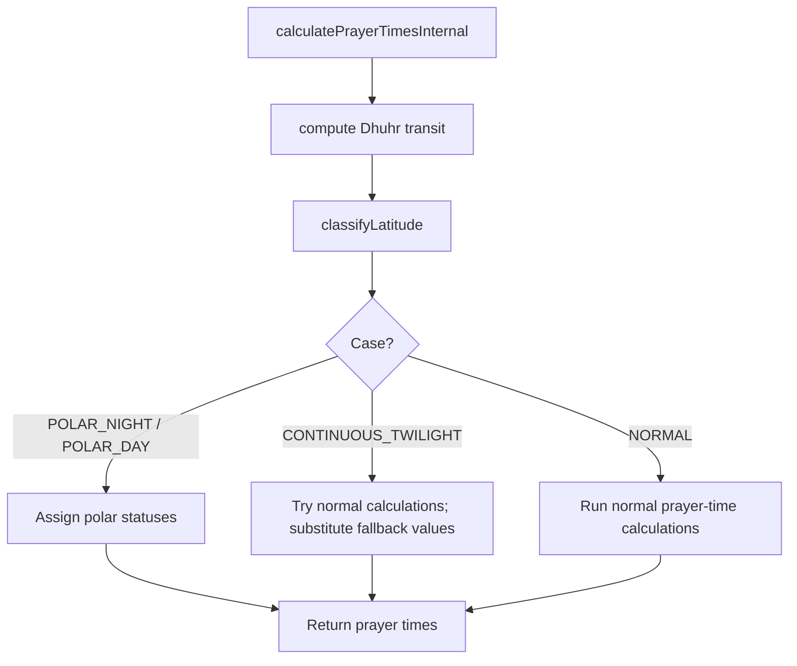

I’ve isolated the classifier, engine, and strategy modules; the remaining step is to connect them into a concise architectural explanation with the relevant formulas and control flow.

## Extreme-latitude handling in this library

The implementation is built around a layered architecture:

1. A classifier decides whether the observer is in a normal, continuous-twilight, polar-day, polar-night, or regional-fallback regime.
2. The prayer engine then chooses a branch that either:
   - runs the normal calculation path, or
   - short-circuits to explicit fallback statuses and substitute times.
3. The high-latitude strategy modules provide alternative heuristics for Fajr/Isha when the geometry becomes ambiguous.

A key detail is that the core branch logic lives in PrayerEngine.ts, while the classifier logic is in LatitudeClassifier.ts. The strategy modules in highLatitude are implemented, but the current hot path in the engine mainly uses them conceptually through the configured strategy and the `NearestLatitude` fallback branch rather than instantiating them directly.

---

## 1. Latitude classification: how the library decides “normal” vs “high/extreme”

The classifier in LatitudeClassifier.ts uses the observer latitude $\phi$, the solar declination $\delta$, and the twilight angle $a$ (the configured Fajr angle).

### Exact threshold and formulas

The first hard guard is:

```ts
if (Math.abs(latitude) >= 89.9) {
  return LatitudeCase.REGIONAL_FALLBACK;
}
```

So the library treats anything at or beyond $89.9^\circ$ as a special “near-pole” region.

Then it computes two solar-altitude values:

```ts
const sinNoon = Math.sin(phiRad) * Math.sin(deltaRad) + Math.cos(phiRad) * Math.cos(deltaRad);
const sinMidnight = Math.sin(phiRad) * Math.sin(deltaRad) - Math.cos(phiRad) * Math.cos(deltaRad);

const hNoonDeg = Math.asin(Math.max(-1, Math.min(1, sinNoon))) * (180 / Math.PI);
const hMidnightDeg = Math.asin(Math.max(-1, Math.min(1, sinMidnight))) * (180 / Math.PI);
```

These are the noon and midnight solar altitudes, expressed in degrees.

### Decision tree

The classifier then applies this logic:

- If `hNoonDeg <= 0` → `POLAR_NIGHT`
- Else if `hMidnightDeg >= 0` → `POLAR_DAY`
- Else if `hMidnightDeg >= -twilightAngle` → `CONTINUOUS_TWILIGHT`
- Else → `NORMAL`

So the library is not using a simple “above 66.5° means high latitude” rule. It uses the actual geometry of the Sun’s path relative to the horizon.

> In practical terms, the engine classifies a region as high-latitude when the Sun’s path either never rises, never sets, or remains above the twilight threshold for the whole night.

---

## 2. High-latitude execution flow

The main orchestration happens in PrayerEngine.ts.

### Pipeline



### What changes in the flow?

The engine does not alter the iterative solver’s initial bounds or search interval directly. Instead, it changes the branch of logic:

- For `POLAR_NIGHT` and `POLAR_DAY`, it bypasses the normal prayer-time solving for many prayers and assigns statuses directly.
- For `CONTINUOUS_TWILIGHT`, it still tries the normal calculations, but if the computed Fajr/Isha values are missing or invalid, it substitutes a deterministic fallback.

### The fallback branch

The engine uses this condition:

```ts
const useFallback =
  latCase === LatitudeCase.REGIONAL_FALLBACK ||
  ((latCase === LatitudeCase.POLAR_NIGHT || latCase === LatitudeCase.POLAR_DAY) &&
    highLatitudeStrategy === 'NearestLatitude');
```

If `useFallback` is true, it does not use the actual latitude; it uses an anchor latitude:

```ts
const sign = latitude < 0 ? -1 : 1;
const anchorLat = sign * config.regionalFallbackLatitude;
rawResults = calculateRawTimes(config, anchorLat);
```

The default regional fallback latitude is `45` degrees, as set in validatePrayerConfig.ts.

---

## 3. High-latitude strategies

The strategy modules are in highLatitude. They implement four explicit philosophies.

| Strategy | Core idea | Formula / rule |
|---|---|---|
| `AngleBased` | Use a fixed angular fraction of the night duration | `fajr = safeSunrise - nightDuration * (fajrAngle / 60)` and `isha = safeSunset + nightDuration * (ishaAngle / 60)` |
| `MiddleOfNight` | Place the prayer at the midpoint of the safe night window | `fajr = safeSunset + (nextSunrise - safeSunset)/2` or midpoint of the available night duration |
| `SeventhOfNight` | Use one-seventh of the night duration | `fajr = safeSunrise - nightDuration/7`, `isha = safeSunset + nightDuration/7` |
| `NearestLatitude` | Recompute at a safer “anchor” latitude near the pole | anchor latitude = $\pm 45^\circ$ by default |

### Why these strategies exist

They encode different philosophical interpretations of “what should a prayer time be” when the real twilight geometry never produces a conventional Fajr/Isha event:

- `AngleBased`: most directly tied to the astronomical angle.
- `MiddleOfNight`: interprets the prayer as a midpoint of the night and is often a robust, symmetric choice.
- `SeventhOfNight`: a traditional fractional-night rule.
- `NearestLatitude`: avoids the impossible local geometry by solving at a nearby latitude that is not in the polar regime.

### Default strategy

The validator sets the default to `MiddleOfNight` in validatePrayerConfig.ts:

```ts
const highLatitudeStrategy = config.highLatitudeStrategy ?? 'MiddleOfNight';
```

The code does not include a long justification comment, but the practical reason is clear: it is a balanced, robust fallback that uses the actual night window rather than a fixed angular ratio or a regional anchor latitude. It is less aggressive than `SeventhOfNight` and less dependent on a single angular threshold than `AngleBased`.

> One subtle architectural point: the current engine path does not instantiate these modules directly in the hot path. The configured strategy is validated and defaults to `MiddleOfNight`, but the main logic in PrayerEngine.ts uses explicit branches for polar-day/night and continuous-twilight rather than fully dispatching to the strategy classes.

---

## 4. Polar Day / Polar Night handling

When the Sun never rises or never sets, the engine does not try to produce a conventional Fajr/Sunrise/Maghrib time. It assigns explicit statuses.

### Behavior

- In `POLAR_NIGHT`:
  - Fajr = `POLAR_NIGHT`
  - Sunrise = `POLAR_NIGHT`
  - Maghrib = `POLAR_NIGHT`
  - Isha = `POLAR_NIGHT`
  - Asr = `POLAR_NIGHT`

- In `POLAR_DAY`:
  - Fajr = `POLAR_DAY`
  - Sunrise = `POLAR_DAY`
  - Maghrib = `POLAR_DAY`
  - Isha = `POLAR_DAY`
  - Asr is computed dynamically from the transit and shadow ratio if possible; otherwise it becomes `POLAR_DAY`

### Dhuhr behavior

Dhuhr is special: it is still computed from the solar transit and remains `SUCCESS` with a normal timestamp. The code does this in PrayerEngine.ts:

```ts
const dhuhrStatus: PrayerStatus = 'SUCCESS';
const dhuhrTime: Date = dhuhrRes.time;
```

So the library preserves the noon transit even when the Sun never rises or sets.

### Status summary

| Prayer | Polar Night | Polar Day |
|---|---|---|
| Dhuhr | `SUCCESS` | `SUCCESS` |
| Sunrise | `POLAR_NIGHT` | `POLAR_DAY` |
| Maghrib | `POLAR_NIGHT` | `POLAR_DAY` |

---

## 5. Missing Fajr/Isha in continuous twilight

This is the most interesting edge case. When the Sun never reaches the configured twilight angle, Fajr/Isha may not exist mathematically. The engine handles this in the `CONTINUOUS_TWILIGHT` branch in PrayerEngine.ts.

### What the engine does

It first tries to compute the normal Fajr/Isha times. If one of them is invalid or missing, it substitutes a fallback:

```ts
if (!fajrValid && ishaValid) {
  const midnight = calculateAstronomicalMidnight(...);
  fajrTime = midnight;
  fajrStatus = midnight ? 'ASTRONOMICAL_MIDNIGHT' : 'CONTINUOUS_TWILIGHT';
}
```

And for Isha:

```ts
else if (fajrValid && !ishaValid) {
  ishaTime = null;
  ishaStatus = 'CONTINUOUS_TWILIGHT';
}
```

If both are missing:

```ts
fajrTime = midnight;
fajrStatus = midnight ? 'ASTRONOMICAL_MIDNIGHT' : 'CONTINUOUS_TWILIGHT';
ishaTime = null;
ishaStatus = 'CONTINUOUS_TWILIGHT';
```

### Semantic statuses

The engine may return:

- `SUCCESS`: the time exists normally
- `CONTINUOUS_TWILIGHT`: the twilight never reaches the threshold, so no conventional Fajr/Isha exists
- `ASTRONOMICAL_MIDNIGHT`: the engine substitutes the astronomical midnight anchor for Fajr
- `REGIONAL_FALLBACK`: the engine switches to the fallback latitude strategy path

### Underlying rule for shifting the time

The shift is not arbitrary. The engine uses physical/astronomical anchors:

- For Fajr, it uses astronomical midnight when the dawn-side event is missing.
- For the fallback path, it recomputes at a nearby anchoring latitude.
- For the strategy modules, it uses a proportion of the safe night duration:
  - angle-based fraction of the night
  - half-night midpoint
  - one-seventh of the night

So the philosophy is: when the geometry does not permit a true twilight crossing, the engine replaces the missing prayer time with a deterministic anchor derived from the night’s structure rather than leaving it as an undefined null time.

---

## Architectural conclusion

This library handles extreme latitudes with a pragmatic, layered approach:

- The classifier determines the regime from the Sun’s actual path.
- The engine then chooses between:
  - normal solving,
  - explicit polar-day/night statuses,
  - continuous-twilight fallback values,
  - or regional fallback at a safer latitude.
- The strategy modules encode different interpretive rules for Fajr/Isha when the twilight event is mathematically absent.

In short, the library is not merely “failing” at high latitudes; it is explicitly translating impossible or undefined solar events into a bounded and meaningful set of prayer-time outcomes.
