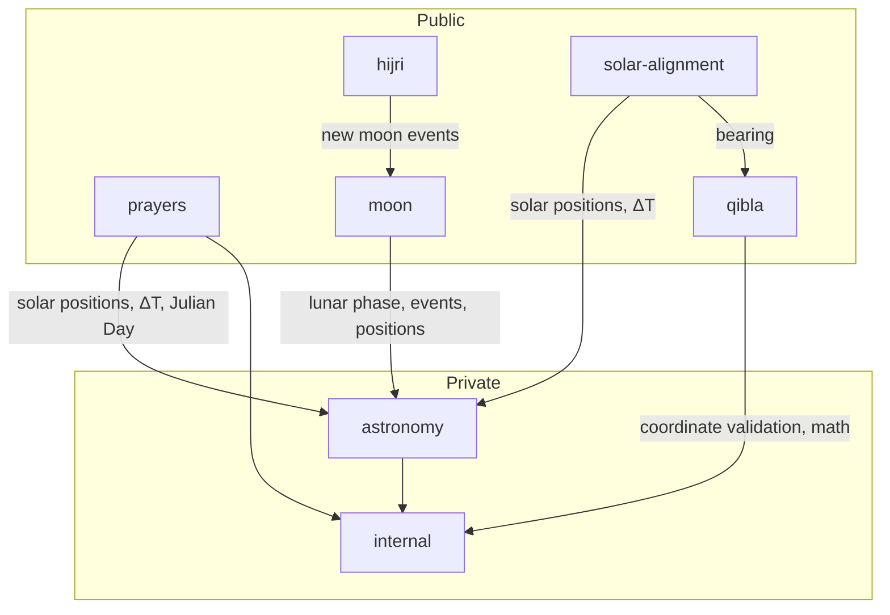

# Architecture & Modules

> **Interactive dependency visualizer:** [https://tauqeet-js.web.app](https://tauqeet-js.web.app)

This document explains how `tauqeet-js` is structured internally, how the modules depend on each other, and how to import only the parts you need.

---

## Table of Contents

1. [High-Level Architecture](#1-high-level-architecture)
2. [Dependency Graph](#2-dependency-graph)
3. [Module Descriptions](#3-module-descriptions)
   - [astronomy (private)](#31-astronomy-private)
   - [internal (private)](#32-internal-private)
   - [prayers](#33-prayers)
   - [qibla](#34-qibla)
   - [moon](#35-moon)
   - [hijri](#36-hijri)
   - [solar-alignment](#37-solar-alignment)
4. [Public API Surface](#4-public-api-surface)
5. [Tree-Shaking & Bundle Size](#5-tree-shaking--bundle-size)
6. [Design Principles](#6-design-principles)

---

## 1. High-Level Architecture

```
┌─────────────────────────────────────────────────────────────────┐
│                        PUBLIC API LAYER                          │
│   prayers │ qibla │ moon │ hijri │ solar-alignment              │
└─────────────────────────────────────────────────────────────────┘
                              │
                              │  uses
                              ▼
┌─────────────────────────────────────────────────────────────────┐
│                   ASTRONOMY ENGINE (private)                     │
│  VSOP87 Solar Ephemeris │ Lunar Theory │ ΔT │ Julian Day        │
└─────────────────────────────────────────────────────────────────┘
                              │
                              │  uses
                              ▼
┌─────────────────────────────────────────────────────────────────┐
│                   INTERNAL UTILITIES (private)                   │
│  math.ts │ normalize.ts │ validation.ts                         │
└─────────────────────────────────────────────────────────────────┘
```

The library is layered:
- **Public modules** expose the Islamic-computation API.
- **Astronomy engine** provides raw ephemeris data (solar/lunar position, events, ΔT) consumed by the public modules.
- **Internal utilities** contain shared mathematical helpers (trigonometry, coordinate validation, angle normalisation).

---

## 2. Dependency Graph



**Key relationships:**

| Module | Depends on |
|---|---|
| `prayers` | `astronomy` (solar position, ΔT), `internal` (math, validation) |
| `qibla` | `internal` (haversine, validation) |
| `moon` | `astronomy` (lunar position, phase, events, ΔT) |
| `hijri` | `moon` (new moon events via astronomy) |
| `solar-alignment` | `astronomy` (solar position), `qibla` (bearing), `internal` |
| `astronomy` | `internal` (math, normalize) |

---

## 3. Module Descriptions

### 3.1 `astronomy` (private)

**Location:** `src/astronomy/`  
**Exposed externally:** No. All exports are consumed internally.

Contains the core numerical ephemeris:

| Sub-module | Description |
|---|---|
| `bodies/sun/SolarEphemeris` | VSOP87-derived high-precision solar position (RA, Dec, EoT, GHA) |
| `bodies/moon/LunarEphemeris` | Lunar position (RA, Dec, GHA, HP, SD) via truncated lunar theory |
| `bodies/moon/LunarPhase` | Moon–Sun elongation and illuminated fraction |
| `phenomena/LunarEvents` | Iterative solver for new/full moon times (accurate to ~1 minute) |
| `time/JulianDate` | Gregorian ↔ Julian Day conversion, time arguments |
| `time/DeltaT` | Polynomial ΔT (Terrestrial − Universal Time) approximation |
| `earth/` | Nutation corrections |
| `theories/` | Orbital theory coefficients |

**Key functions consumed internally:**

```ts
computeSolarPosition(jd, ut, deltaT) → SolarPositionResult
computeLunarPosition(jd, ut, deltaT) → LunarPositionResult
computeLunarPhase(jd, ut, deltaT)    → { elongation, illuminatedFraction }
computeNextNewMoon(jd, deltaT)       → EventTime
computePreviousNewMoon(jd, deltaT)   → EventTime
dateToJulianDay(y, m, d)             → number
calculateDeltaT(year)                → number  // seconds
```

---

### 3.2 `internal` (private)

**Location:** `src/internal/`  
**Exposed externally:** No.

Shared low-level utilities:

| File | Description |
|---|---|
| `math.ts` | Haversine distance, spherical bearings, rhumb-line, `toDegrees`, `toRadians` |
| `normalize.ts` | `normalizeAngle`, range clamping |
| `validation.ts` | `validateCoordinates` — throws `RangeError` for out-of-range lat/lon |

---

### 3.3 `prayers`

**Location:** `src/prayers/`  
**Public entry:** `src/prayers/index.ts`

The most complex module. Internal sub-directories:

| Sub-directory | Description |
|---|---|
| `config/` | `BUILT_IN_METHODS` registry, `Madhab` enum, `ASR_SHADOW_FACTOR` |
| `engine/` | `PrayerEngine` — orchestrates the iterative solver per prayer event |
| `solvers/` | Per-prayer iterative solvers (Fajr, Sunrise, Dhuhr, Asr, Maghrib, Isha) |
| `highLatitude/` | Pluggable strategies: `AngleBased`, `MiddleOfNight`, `SeventhOfNight`, `NearestLatitude` |
| `corrections/` | Atmospheric refraction, altitude dip, parallax corrections |
| `calculations/` | Hour-angle and zenith-distance mathematics |
| `formatter/` | `formatPrayerTimes` utility |
| `validators/` | `validatePrayerConfig` — normalises and validates the user's `PrayerConfig` |
| `types/` | All public types: `PrayerConfig`, `PrayerTimesResult`, `TimeField`, etc. |

---

### 3.4 `qibla`

**Location:** `src/qibla/`  
**Public entry:** `src/qibla/index.ts`

Lightweight module with no astronomy dependency — it uses only internal math utilities.

| File | Description |
|---|---|
| `direction/bearing.ts` | `getQiblaDirection`, `getQiblaAdvanced` |
| `direction/distance.ts` | `getQiblaDistance` |
| `constants.ts` | Kaaba coordinates (21.4225° N, 39.8262° E) and Earth radius |
| `types/index.ts` | `QiblaCoordinates`, `QiblaDirectionResult`, `QiblaAdvancedResult` |

---

### 3.5 `moon`

**Location:** `src/moon/`  
**Public entry:** `src/moon/index.ts`

| Sub-directory | Description |
|---|---|
| `phase/` | `getMoonPhase`, `getMoonAge`, `getMoonIllumination` |
| `events/` | `getNextNewMoon`, `getPreviousNewMoon`, `getNextFullMoon`, `getPreviousFullMoon` |
| `visibility/` | `checkVisibility`, `checkMultipleCriteria`, `OdehCriterion`, `YallopCriterion`, `HMNAOCriterion` |
| `utils/sunset.ts` | `getSunset` — used internally by the visibility engine |
| `types/` | All moon-specific public types |

---

### 3.6 `hijri`

**Location:** `src/hijri/`  
**Public entry:** `src/hijri/index.ts`

| Sub-directory | Description |
|---|---|
| `engine/HijriEngine.ts` | Façade class — delegates to the correct calendar implementation |
| `methods/civil/` | `CivilCalendar` — 30-year arithmetic cycle |
| `methods/astronomical/` | `ConjunctionCalendar` — based on new moon (UTC conjunction) |
| `methods/sighting/` | `VisibilityCalendar` — crescent visibility at observer location |
| `methods/ummalqura/` | `UmmAlQuraCalendar` — official Saudi calendar (tabular hybrid) |
| `core/` | `HijriMonthLength`, `HijriYearLength`, `HijriEpoch` constants |
| `converters/` | Helper functions for JD ↔ Hijri arithmetic |
| `types/` | `HijriDate`, `HijriMethod`, `HijriCalendarResult`, `HijriLocationOptions` |

The **Hijri module** depends on the **Moon module** for conjunction times — it does not call the astronomy engine directly. This keeps the dependency hierarchy clean.

---

### 3.7 `solar-alignment`

**Location:** `src/solar-alignment/`  
**Public entry:** `src/solar-alignment/index.ts`

| File | Description |
|---|---|
| `sunAtQibla.ts` | `getSunAtQibla` — PZX spherical-triangle solver |
| `types/index.ts` | `SunAlignmentConfig`, `SolarTimeField`, `SunAtQiblaResult` |

This module is the only public module that depends on both `qibla` (for the bearing) and `astronomy` (for solar position).

---

## 4. Public API Surface

Everything exported from `src/index.ts` is the library's public contract:

```ts
// src/index.ts
export * from './prayers/index.js';
export * from './qibla/index.js';
export * from './solar-alignment/index.js';
export * from './moon/index.js';
export * from './hijri/index.js';
```

The `src/astronomy/` and `src/internal/` directories are **not re-exported** from `src/index.ts` and are considered implementation details. They may change between minor versions.

---

## 5. Tree-Shaking & Bundle Size

`tauqeet-js` is bundled with [`tsup`](https://tsup.egoist.dev/) which produces:
- `dist/index.js` — ESM bundle
- `dist/index.cjs` — CommonJS bundle
- `dist/index.d.ts` — TypeScript declarations

Because the library uses **named exports only** (no default export, no side effects), modern bundlers (Webpack 5, Rollup, Vite, esbuild) can tree-shake unused modules.

**Import only what you need:**

```ts
// ✅ Only the prayers module is bundled
import { calculatePrayerTimes, BUILT_IN_METHODS } from 'tauqeet-js';

// ✅ Only qibla code is bundled
import { getQiblaDirection } from 'tauqeet-js';

// ✅ Only moon phase code is bundled
import { getMoonPhase, getMoonAge } from 'tauqeet-js';
```

> **Note on the astronomy engine:** Even though `src/astronomy` is private, it is bundled because the public modules depend on it. Only the _public modules you import_ pull in the relevant astronomy code paths.

**Approximate contribution to bundle size:**

| Module | Approx. gzipped size |
|---|---|
| `prayers` (full) | ~12 KB |
| `qibla` only | ~3 KB |
| `moon` (phase + age) | ~8 KB |
| `moon` (visibility) | ~11 KB |
| `hijri` (civil only) | ~5 KB |
| `hijri` (all methods) | ~14 KB |

> These are rough estimates. Always measure with your bundler's analysis tool.

---

## 6. Design Principles

### Functional Core, Immutable Data

All public functions are stateless pure functions. Prayer-time functions accept a config and return a result — no class instances, no shared mutable state.

The exception is `HijriEngine`, which is a class for ergonomics (allows calling `toHijri` and `toGregorian` repeatedly with the same configuration), but it holds no mutable state itself.

### Result Pattern

Functions that can fail due to invalid user input provide two flavours:
- **Throw** variant (`calculatePrayerTimes`) — for applications that prefer try/catch.
- **Result** variant (`getPrayerTimes`) — returns `{ success, data }` or `{ success, error }`, safe to call without try/catch.

### Iterative Refinement

Prayer times, moon events, and sun-at-Qibla times are computed with **iterative refinement** (2–4 iterations) rather than single-pass estimation. Each iteration re-evaluates the solar/lunar position at the refined time, converging to sub-second accuracy.

### High-Latitude Safety

When the sun's angle cannot resolve (polar day/night or continuous twilight), the engine sets the corresponding `TimeField.status` to a descriptive code rather than throwing or returning garbage data. Callers should always check `status` before using `local` or `timestamp`.

```ts
if (result.fajr.status === 'SUCCESS') {
  display(result.fajr.local);
} else {
  showWarning(`Fajr: ${result.fajr.status}`);
}
```

### Zero External Dependencies

`tauqeet-js` has **no runtime dependencies**. All astronomical algorithms are implemented natively in TypeScript. The only dev dependencies are `tsup` (bundler), `typescript`, and `vitest` (test runner).
